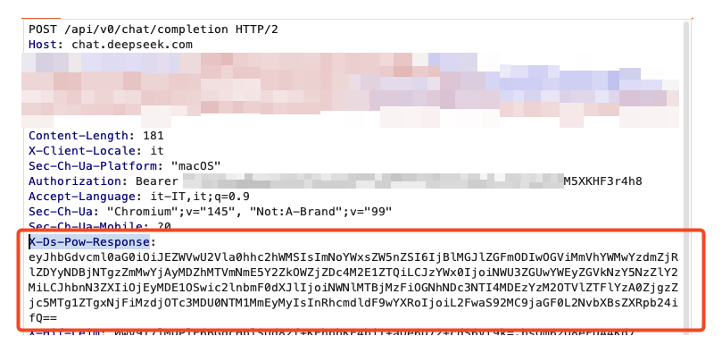
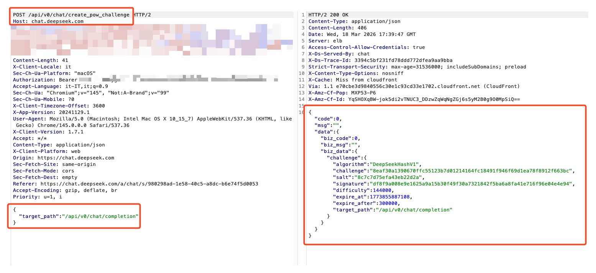
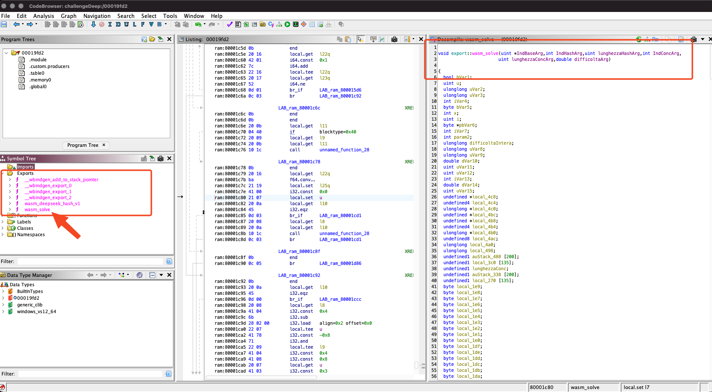
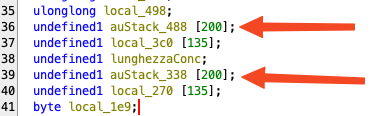
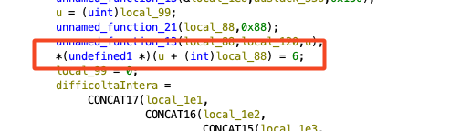
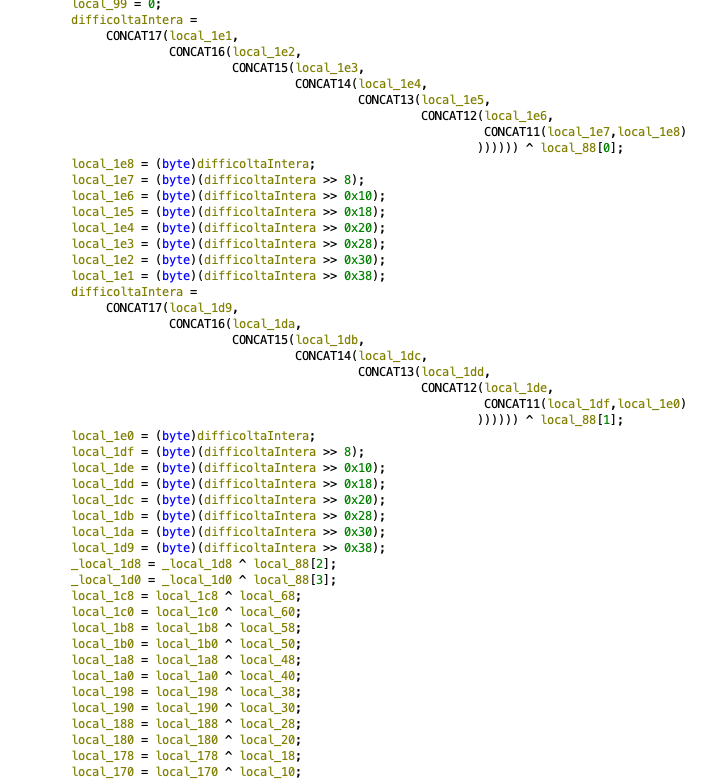
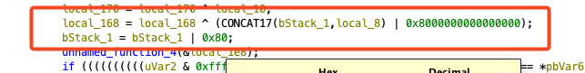
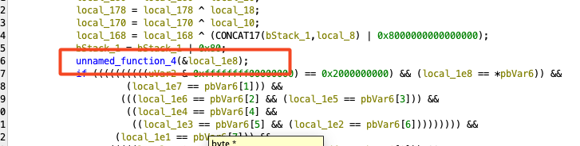
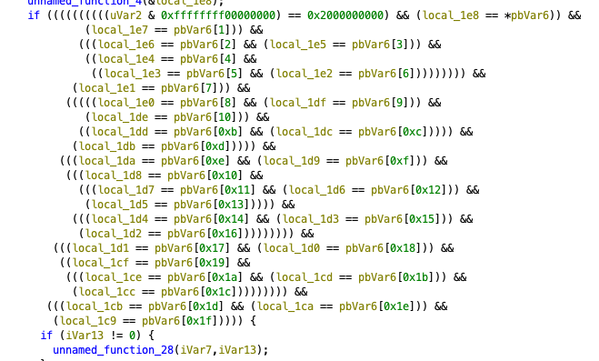

# DeepSeek CLI

This is a CLI that uses the web chat API of Deepseek.  
That means you can create your own custom projects with the Deepseek model without purchasing API tokens.

To prevent this, Deepseek developers implemented a security layer — a hash challenge required for all API calls.  
I reverse engineered this challenge and also created a Python library for it.

Check the video demo:  

VIDEO

## Topics
1. Reverse Engineering  
2. Simple CLI  
3. Python library  

## TO DO on library

    - [ ] API call to upload files

## 1. Reverse Engineering

First, I set up Burp Suite and my browser to inspect all traffic sent to the server. I noticed that every request includes a custom header: `X-Ds-Pow-Response`, which contains a JSON object encoded in base64:



```json
{
    "algorithm":"DeepSeekHashV1",
    "challenge":"0e0bedaf8208eb2eaac0c7ff4ed6240c583fc0b0206a15f6a9cfd9fcd783a5e4",
    "salt":"5e7de0aa2ded76976ecc",
    "answer":120159,
    "signature":"5ce10c31b8ca477528013c3695ee1ec04f83f79185e8161b37c9770545352a23",
    "target_path":"/api/v0/chat/completion"
}
```

This JSON contains:
- The algorithm name: `"DeepSeekHashV1"`.
- The target hash (called `challenge`).
- The salt of the hash.
- The answer to the challenge.
- The signature.
- The target path, used here to send messages into the chat.

To obtain this challenge, the client must first make a POST request to `/api/v0/chat/create_pow_challenge` before any other API call. The body contains a JSON with the `target_path` of the subsequent call.



Solving the challenge requires the following (this information I discovered after analyzing `main.js` and the compiled WASM file):
1. The target hash: `"challenge":"8eaf30a1390670ffc55123b7d01214164fc18491f946f69d1ea78f8912f663bc"`.
2. The salt: `"salt":"8c7c7d75efa43eb22d2a"`.
3. The difficulty: `"difficulty":144000`.
4. The expiration timestamp: `"expire_at":1773855887108`.

### Analysis of `main.ddb03f9fed.js`

After searching for the string `"pow"` and starting the debugger, I noticed that the hash calculation is performed by Web Workers (parallel threads separate from the main thread). Syntax example:

```javascript
let w = new Worker("file.js");
```

The Worker executes the code inside `file.js`. Communication with the worker is done via:

```javascript
w.postMessage("start");
```

Inside `file.js`, there is a function that processes that message. In this article I won't explain JavaScript in detail, so let's proceed with the reverse engineering.

In `main.ddb03f9fed.js`, there are two Workers:

```javascript
// Worker we need to analyze
let t = new Worker(new URL(n.p + n.u("33614"), n.b), Object.assign({},{type:"module"},{type: void 0}))

// Another worker
let t1 = new Worker(new URL(n.p + n.u("38401"), n.b), Object.assign({},{type:"module"},{type: void 0}))
```

I searched in the main file for those two IDs and `n.u`, and found:
- Key `33614` → Value `"1ba98674d4"`
- Key `38401` → Value `"a8c4129551"`

I also found `n.p` which contains a link:  
`https://fe-static.deepseek.com/chat`

The final URL for ID `33614` is:  
`https://fe-static.deepseek.com/chat/static/33614.1ba98674d4.js`

### Analysis of the 33614 JavaScript

In the main JS, there is this code:

```javascript
t.postMessage({
    type: "pow-challenge",
    challenge: e
})
```

The variable `e` contains the JSON (hash, salt, expire_at, etc.).

Inside the `onmessage` handler, a string concatenation is performed:

```
<salt value> + "_" + <expire_at value> + "_"
```

That string is the beginning of the hash input (more on that later).

After concatenation, the JS calls a function stored in a WASM file (written in Rust). The function is:

```javascript
n.wasm_solve(<base address>, <start hash address>, <length of hash>, <start concatenation address>, <length of concatenation>, <difficulty>)
```

So I downloaded the WASM file.

### Analysis of the WASM file

To decompile and analyze a WASM file in Ghidra, you need to install this plugin (from releases):  
[https://github.com/nneonneo/ghidra-wasm-plugin](https://github.com/nneonneo/ghidra-wasm-plugin)

After installing, Ghidra can decompile WASM files.



The algorithm used is a modified SHA3-256 that performs 23 rounds instead of 24.

The answer is found by looping from `0` to `difficulty`. Inside the loop, it computes the hash of the string:

```
<salt value> + "_" + <expire_at value> + "_" + <loop counter>
```

Example:
```
"8c7c7d75efa43eb22d2a_1773855887108_1"
"8c7c7d75efa43eb22d2a_1773855887108_2"
"8c7c7d75efa43eb22d2a_1773855887108_3"
...
```

For each string, it computes the hash and compares it with the hash provided by the server. If they match, the answer is the loop counter.

### How to recognize SHA3-256

SHA3 works with a 200-byte buffer. Look at this image:



A 200-byte buffer initialized with zeros and used with XOR operations indicates KECCAK/SHA3.

Further on, there is an `if` condition checking whether the concatenated string is less than `0x88` (136 decimal). This value is the block size of SHA3-256.

Block sizes for different SHA3 versions:
- 136 bytes → SHA3-256
- 144 bytes → SHA3-224
- 104 bytes → SHA3-384
- 72 bytes  → SHA3-512

The extra 6 bytes are used for padding, which confirms it's a standard SHA3.



After the message, it writes the byte `0x06`. This is the domain separation byte for NIST SHA3. (For standard Keccak it would be `0x01`, for SHAKE it would be `0x1F`.)

Then it performs 17 XOR operations on 8-byte chunks:



At the last byte of the block, it XORs with `0x80` — this is the second byte of the domain separation.



Then it writes `0x80` at the last block and calls a function (likely keccak-f) with the address of the block. This function executes 23 rounds.



After that, it checks if the computed hash equals the hash provided by the server. It compares each byte from `0x00` to `0x1F` (32 bytes = 256 bits).



With this knowledge, I replicated the logic in a Python script and also created a library for your automation.


## 